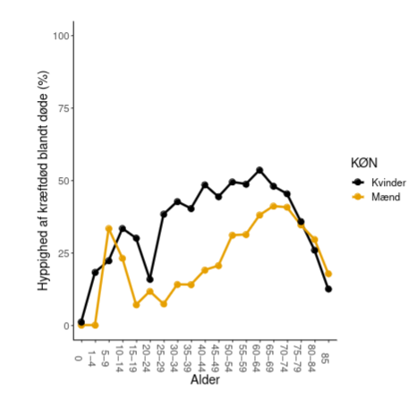

```{r setup}
knitr::opts_knit$set(root.dir = "..")
source("https://raw.githubusercontent.com/tagteam/demogRafi/main/R-scripts/demofunk.R")
```

# Opgave 1

## Del 1

::: incremental
1.  Find register `DODA1` i browseren: <https://www.statistikbanken.dk/>. Hvorfor angiver man alderstrin 0-1 separat fra alderstrin 1-4?

-   Spædbarnsdødelighed.
:::

## Del 2

::: incremental
2.  Find antal mænd og kvinder, som døde på grund af psykiske lidelser i 2018. Beregn de summariske årsagsspecifikke mortalitetsrater separat for mænd og kvinder (årsag = psykiske lidelser).

-   Kig under **FOLK1A** og **DODA1** i statistikbanken, sæt årstal til 2018, angiv både mænd og kvinder og for **DODA1** vælg årsag = A06.
-   Kvinder: 2313/2908,337 = 0,80 per 1000 personår
-   Mænd: 1556/2881,620 = 0,54 per 1000 personår
:::

## Del 2 - R-kode

```{r, echo=TRUE, cache = TRUE}
dpl <- hent_data("doda1",årsag = "A06",tid = 2018,køn = 1:2,alder = "TOT") %>% 
  rename(antal_dod_psyk = INDHOLD) %>% 
  select(antal_dod_psyk,KØN)
N <- hent_data("folk1a",tid = "2018K3",køn = c(1:2),alder = "Alder i alt") %>%
  rename(R = INDHOLD) %>% 
  select(R,KØN)
dt <- left_join(dpl,N,by = "KØN") %>% 
  mutate(rate = 1000*antal_dod_psyk/R)
library(gt)
dt %>% 
  gt() %>% 
  fmt_number(columns = 4, decimals = 2, locale = "da") %>% 
  fmt_number(columns = c(1,3), decimals = 0, locale = "da")
```

## Del 3

::: incremental
3.  Hvorfor er det ikke helt fair at sammenligne mænd og kvinder med hensyn til de summariske rater af dødsfald på grund af psykiske lidelse?

-   Fordi kvinder bliver ældre end mænd, og dødsfald på grund af en psykiske lidelse forekommer hyppigt blandt ældre mennesker.
:::

## Del 4

4.  Brug tal fra statistikbanken til at beregne aldersstandardiserede rater af dødsfald på grund af psykiske lidelser, via direkte standardisering, separat for kvinder og mænd. Standardiser begge rater med hensyn til aldersfordelingen af alle danskere i 2018. Rapporter resultaterne og diskuter forskellene mellem de summariske og de standardiserede rater.

## Del 4 - fortsat

Husk på formel (K2.9) $$\tilde{M}_S^{Q,A}=\sum_{x=1}^m M_x^{Q,A} V_x^S.$$

## Del 4 - fortsat

1.  $M_x^{Q,A}$ = antal døde i aldersintervallet $x$ (for $A$=Mænd og $A$=Kvinder) i 2018 og dødsårsag $Q$=A06. Kan findes som $$
    M_x^{Q,A} = \frac{D^{Q,A}_x}{R_x^A}, 
    $$ hvor $D^{Q,A}_x$ er antal døde i aldersintervallet $x$ og for gruppe $A$ i 2018 og $R_x^A$ er risikotiden i aldersintervallet $x$ og køn $A$ i 2018. Husk på, at vi bruger metode 1.

## Del 4 - fortsat

2.  $V_x^S$ = andel af risikotiden i aldersintervallet $x$ i standardbefolkningen (hele Danmark) i 2018. $$
    V_x^S = \frac{R_x^S}{\sum_{x=1}^m R_x^S}.
    $$

## Del 4 - R-kode

```{r, echo = TRUE, cache = TRUE}
# antal doede pga psykiske lidelser
dpl <- hent_data("doda1",årsag = "A06",tid = 2018,køn = 1:2,alder = "all_no_total")
# omdoeb INDHOLD og alder til antal_dod_psyk og aldersinterval
dpl <- rename(dpl,antal_dod_psyk = INDHOLD,aldersinterval = alder)
# begræns til variable som skal bruges
dpl <- select(dpl,aldersinterval,antal_dod_psyk,KØN)
# middelfolketal begge køn og også total
N <- hent_data("folk1a",tid = "2018K3",køn = c(1:2,"TOT"),alder = "all_no_total")
# metode 1 giver riskotid
N <- rename(N,R = INDHOLD)

# kategorisere i samme intervaller som data dpl
R <- intervAlder(N,breaks = c(0,1,seq(5,85,5),Inf),right = FALSE,by = "KØN",vars = "R",label_last = "85")
# beregn aldersfordeling af risikotid bland alle dansker
V <- filter(R,KØN == "I alt") %>% mutate(V=R/sum(R)) %>% select(aldersinterval,V) #ad 2
# join vægte med køn-specifik risikotid
dat <- filter(R,KØN != "I alt") %>% left_join(V,by = "aldersinterval")
# 
dat <- left_join(dpl,dat,by = c("aldersinterval","KØN"))
# 
# Direkte standardisering
#
# 1. beregn aldersspecifikke rater
dat <- mutate(dat,rate_dod_psyk =  1000*antal_dod_psyk/R) #ad 1
# 2. beregn alderstandardiserede rater
dt <- dat %>% group_by(KØN) %>% summarise(std_cause_mrate = sum(rate_dod_psyk*V)) #ad sum
library(gt)
dt %>% gt() %>% fmt_number(columns = 2, decimals = 3, locale = "da")
```

## Kommentarer
-   Aldersstandardiserede rater af dødsfald (psykisk lidelse; standardbefolkning: den danske befolkning) i 2018 var 0,659 per 1000 personår for mænd og 0,651 per 1000 personår for kvinder. De er altså næsten ens, så forskellen kunne nok godt forklares med at der var en forskel i aldersfordelingen. 

# Opgave 2

## Del 1

::: incremental
1.  Hvordan giver følgende udsagn mening? *Tabelbefolkningen bliver født og lever hele deres liv i et år*.

-   Det giver mening, hvis man har beregnet dødelighedstavlen baseret på aldersspecifikke mortalitetsrater som gælder i dag. En 'person' fra tabelbefolkningen bliver 'udsat' for alle dødshyppigheder på tværs af alle aldersintervaller.
:::

## Del 2

{fig-align="center"}

::: incremental
2.  I figuren ovenfor, er antal personer som dør af kræft højere i aldersintervallet 5-9 end i aldersintervallet 45-49?
:::

## Del 2 - fortsat

-   Kan ikke afgøres ud fra figuren. Her ses kun relativt antal døde.

## Del 3

3.  Fortolk alle tal i rækken for aldersintervallet 70-74 år i den årsagsspecifikke dødelighedstavle, hvor mænd i Danmark i 2018 nedenfor (dødsårsagen er kræft, se forelæsningsnoterne).

| Alder | $\ell_x$ | ${}_kd_x$ | ${}_kd_x^{\text{Kraeft}}$ | $\operatorname{LTR}_x^{\text{Kraeft}}$ | $_xq^{\text{Kraeft}}_0$ | $o_x$ |
|----------|----------|----------|----------|-------------|----------|----------|
| 70-74 | 80072     | 9391       | 3734                        | 25,33                                    | 10,22                      | 70,68 |

- Fortolkning som i delopgave 1; de lever hele deres liv i et år. 

## Del 3 - fortsat
- $\ell_x$: I starten af aldersintervallet 70-74 er 80072 'personer' (70,68%) fra tabelbefolkningen i live.
- ${}_kd_x$: I intervallet dør 9391.
- ${}_kd_x^{\text{Kraeft}}$: 3734 dør af kræft.
- $\operatorname{LTR}_x^{\text{Kraeft}}$: Risikoen for at dø af kræft i resten af livet er 25,33%, når man er blevet 70.
- $_xq^{\text{Kraeft}}_0$: Risiko for kræftdød inden 70-års alderen er 10,22%.
- $o_x$: Sandsynligheden for at blive 70-år gammel er 70,68%.

# Opgave 3

::: {.incremental}
1.  Beregn aldersspecifikke mortalitetsrater af kræft i 2010 og 2020 baseret på data fra statistikbanken for mænd og plot resultatet.
2.  Beregn andel kræftdødsfald blandt døde og bagefter årsagsspecifikke dødelighedstavler for mænd i 2010 og 2020 i Danmark.
:::

## Opgaveformulering - fortsat

::: {.incremental}
3.  Rapporter livstidsrisiko for dødsfald med kræft som dødsårsag i 2010 og i 2020 (danske mænd).
4.  Sammenlign 2010 og 2020 med hensyn til de aldersspecifikke rater af kræftdødsfald og risiko for at dø af kræft (danske mænd). 
:::

## Opgave 3 - R-kode
```{r, echo = TRUE, cache = TRUE}
x <- hent_dodsaarsag_data(tid = c(2010,2020), årsag =c("A02"), køn = "Mænd")
x <- mutate(x,M = Dod/R, Q_rate = 1000*QDod/R, hQ = QDod/Dod, TID = factor(TID)) #mortalitetsrater, kræftdødsrate, andel kræftdødsfald, TID skal være factor
# plot 
g = ggplot(x,aes(x = aldersinterval,y = Q_rate,group = TID,color = TID))+geom_line(linewidth = 1.3)
g
```

## Pænere formatering
```{r, echo = TRUE, cache = TRUE}
g <- g + theme_gray()+scale_colour_wsj("colors6")
g <- g+theme(axis.title.y = element_text(margin = margin(t = 0, r = 20, b = 0, l = 0)))
g <- g+theme(axis.title.x = element_text(margin = margin(t = 20, r = 0, b = 0, l = 0)))
g <- g+theme(text = element_text(size=15))
g <- g + ylab("Kræftdødsfaldsrate per 1000 personår")+xlab("Alder")
g
```

## R - kode - Tavle for 2010

```{r, echo = TRUE, cache = TRUE}
# Chiang's a og andel kræftdødsfald
x <- x %>% group_by(TID) %>% mutate(a = c(0.1,2,rep(2.5,17)),k = c(1,4,rep(5,17)), hQ = QDod/Dod)
tavle_2010 = filter(x,TID == 2010) %>% dodsaarsagtavle(mortalitet = "M", hQ = "hQ", alder = "aldersinterval", radix = 100000)
tavle_2010 %>% 
  gt() %>% 
  fmt_number(columns = c("l","d","L"), decimals = 0, locale = "da") %>% 
  fmt_number(columns = c("dQ","hQ","p","e","o","LTR_Q"), decimals = 2, locale = "da") %>%
  fmt_scientific(columns = c("q","qQ", "T","risiko_Q"), n_sigfig = 3, locale = "da")
```

## R - kode - Tavle for 2020
```{r, echo = TRUE, cache = TRUE}
tavle_2020 = filter(x,TID == 2020) %>% dodsaarsagtavle(mortalitet = "M", hQ = "hQ", alder = "aldersinterval", radix = 100000)
tavle_2020 %>% 
gt() %>% 
  fmt_number(columns = c("l","d","L"), decimals = 0, locale = "da") %>% 
  fmt_number(columns = c("dQ","hQ","p","e","o","LTR_Q"), decimals = 2, locale = "da") %>%
  fmt_scientific(columns = c("q","qQ", "T","risiko_Q"), n_sigfig = 3, locale = "da")
```

## Opgave 3 - Besvarelse

::: {.incremental}
2. For dødshyppighed blandt døde (aldersspecifik) kig under hQ.
3. Livstidsrisiko for at dø af kræft er 28,0% baseret på de årsagsspecifikke mortalitetsrater for mænd i Danmark fra 2010 og også 28,0% baseret på årsagsspecifikke mortalitetsrater for mænd i Danmark fra 2020.
4. Se plot(s). 
:::

## Ekstra plot

```{r, echo = TRUE, cache = TRUE}
tavle_2010$Tid <- 2010
tavle_2020$Tid <- 2020
tavle_til_plot <- rbind(tavle_2010,tavle_2020)
tavle_til_plot$Tid <- as.factor(tavle_til_plot$Tid)
gg <- ggplot(tavle_til_plot,aes(x = Alder,y = LTR_Q,group = Tid,color = Tid))+geom_line(linewidth = 1.3)+ylab("Restlivstidsrisikoen for død af kræft")+xlab("Alder") + theme_gray()+scale_colour_wsj("colors6")+theme(axis.title.y = element_text(margin = margin(t = 0, r = 20, b = 0, l = 0)))+theme(axis.title.x = element_text(margin = margin(t = 20, r = 0, b = 0, l = 0)))+theme(text = element_text(size=15))
gg
```

## Ekstra plot 2

```{r, echo = TRUE, cache = TRUE}
ggplot(tavle_til_plot,aes(x = Alder,y = qQ,group = Tid,color = Tid))+geom_line(linewidth = 1.3)+ylab("Risikoen for at en nyfødt dør af årsag af kræft inden alder x")+xlab("x") + theme_gray()+scale_colour_wsj("colors6")+theme(axis.title.y = element_text(margin = margin(t = 0, r = 20, b = 0, l = 0)))+theme(axis.title.x = element_text(margin = margin(t = 20, r = 0, b = 0, l = 0)))+theme(text = element_text(size=15))
```
 
## Kommentarer

::: {.incremental}
  - Aldersspecifikke mortalitetsrater pga. kræft er højere i 2010 end i 2020 for midaldrende og ældre. Det samme er gældende for sandsynligheden for at en nyfødt dør af kræft inden alder x.
  - Alligevel er restlivstidsrisikoen for kræft generelt lavere i 2010 end i 2020.
  - Det skyldes at mortalitetsraterne for at dø af andet end kræft er mindre i 2020.
:::