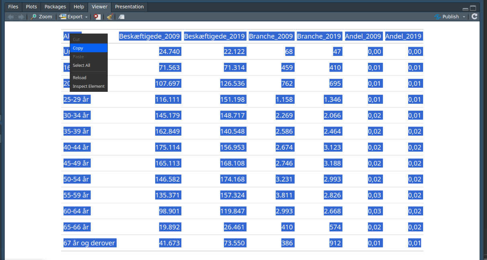
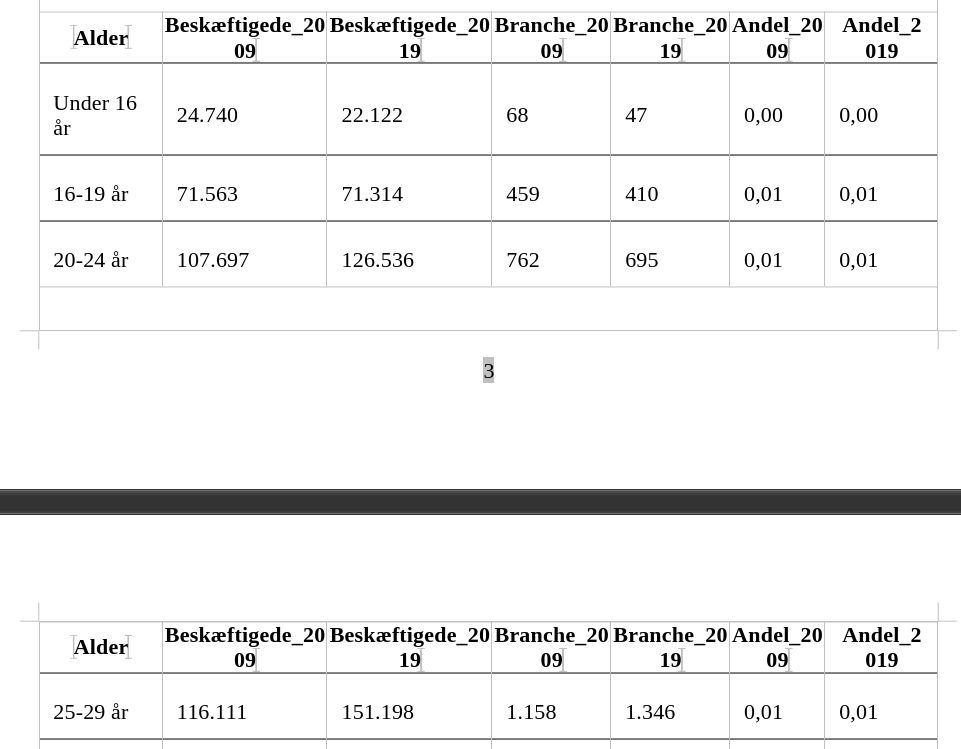
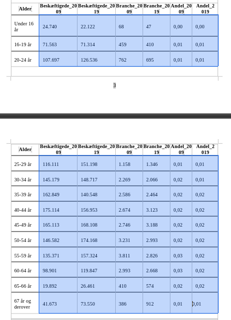
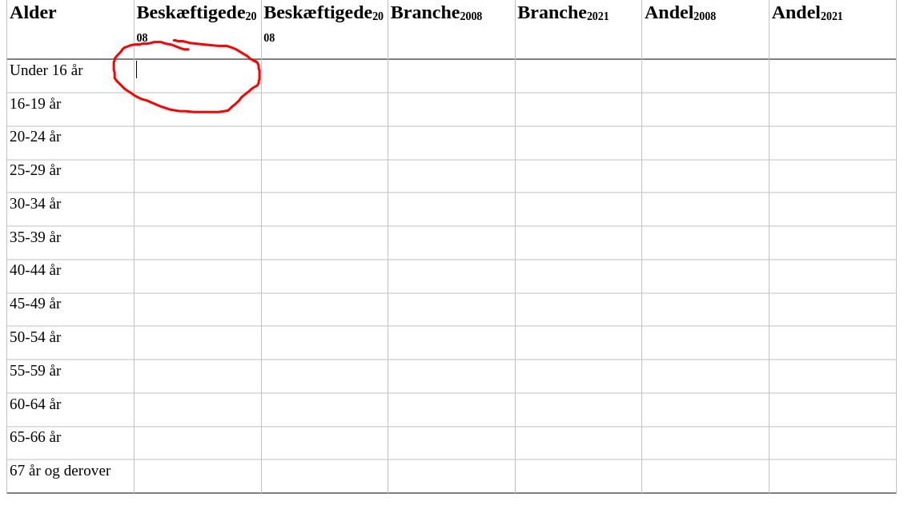
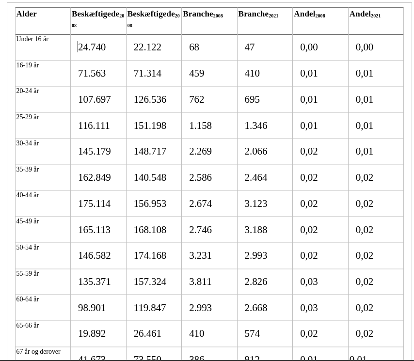

```{r setup}
knitr::opts_knit$set(root.dir = "..")
source("https://raw.githubusercontent.com/tagteam/demogRafi/main/R-scripts/demofunk.R")
## set cache = TRUE
knitr::opts_chunk$set(echo=TRUE)#cache = TRUE 
```

## Opgave 1 {style="font-size: 78%;"}

Hent data fra statistikbankens register RAS300 som ligger under ‘Arbejde
og indkomst’. For årene 2009 og 2019: find det totale antal beskæftigede
mænd i Danmark og antal mænd, som arbejdede i branchen ‘85002 Gymnasier
og erhvervsfaglige skoler’ i aldersintervaller, hvor det første interval
er ‘Under 16 år’ og det sidste ‘67 år og derover’.

Beregn for begge årstal aldersspecifikke andele af mænd i branchen
‘85002 Gymnasier og erhvervsfaglige skoler’ blandt beskæftigede mænd, og
udfyld tabellen nedenfor.

Beregn og rapporter hvor mange ud af 1000 beskæftigede mænd, der har
arbejdet i branchen ‘85002 Gymnasier og erhvervsfaglige skoler’ i årene
2009 og 2019. Diskuter tidsudviklingen i branchen ‘85002 Gymnasier og
erhvervsfaglige skoler’.

## Aldersspecifikke beskæftigelsesrater

```{r}
## hent data
arb_dat <- hent_data("RAS300", 
                     branche07=c(85002,"TOT"),
                     alder = "all", 
                     tid = c("2009","2019"), 
                     køn = "mænd") %>% 
  mutate(BRANCHE07 = fct_recode(BRANCHE07,
                                "Branche" = "85002 Gymnasier og erhvervsfaglige skoler", 
                                "Beskæftigede" = "TOT Erhverv i alt"),
         "Alder" = ALDER)

table_opg_1 <- arb_dat %>%
  pivot_wider(names_from = c(BRANCHE07, TID), 
              values_from = "INDHOLD") %>%
  mutate(Andel_2009 = Branche_2009/Beskæftigede_2009, 
         Andel_2019 = Branche_2019/Beskæftigede_2019) %>%
  select(Alder,
         Beskæftigede_2009, 
         Beskæftigede_2019, 
         Branche_2009,
         Branche_2019, 
         Andel_2009, 
         Andel_2019) 
```

## Eksempelbrug med eksport fra **R** til **Word**

## Brug af **gt**-pakken

```{r}
## I skal køre nedenstående linje uden hashtags, hvis I får fejlen 'Error in library("gt") : there is no package called ‘gt’'
## install.packages("gt") 
library(gt) 
res_table_opg_1 <- table_opg_1 %>%
  gt() %>%
  fmt_number(columns = c("Beskæftigede_2009", "Beskæftigede_2019", "Branche_2009", "Branche_2019"),
             decimals = 0, locale = "da") %>% ## Antal personer skal være angivet i HELE tal; bruug dansk formatering
  fmt_number(columns = c("Andel_2009", "Andel_2019"), 
             decimals = 3, locale = "da") ## Andel angivet som kommatal med to decimaler; brug dansk formatering
```

## Tabel

```{r, echo = FALSE}
res_table_opg_1
```


## Trin 1: Marker tabel



::: {.incremental}
-   Brug Ctrl + C for at kopiere tabellen eller højreklik og vælg
    **Copy**.
-   Markeringen kan let laves ved at højreklikke på tabellen og vælge
    **Select All** (hvis tabellen vises i panelet).
:::

## Trin 2: Sæt ind i **docx**-filen for jeres besvarelse {style="font-size: 80%;"}



::: {.incremental}
-   Brug Ctrl + V for at indsætte tabellen i et
    Word/tekstredigeringsprogram.
:::

## Hvis ikke kopieringen giver jer en tabel i Word

```{r,eval=FALSE}
res_table_opg_1 %>% gtsave("min_tabel.docx")
```

::: {.incremental}
- Åbn filen **min_tabel.docx** i Word.
:::

## Trin 3: Udvælg rækker til opgavens tabel

::: {.incremental}
-   Da I ikke må indsætte jeres egen tabel skal I udvælge de rækker og
    søjler, I vil bruge og kopiere dem ind i tabellen i Word.
-   Marker søjlerne og rækkerne der er relevante for opgavens tabel og kopier dem.
:::

## Billede til Trin 3



## Trin 4: Sæt ind i tabellen til besvarelsen.


::: {.incremental}
-   Brug Ctrl + V for at indsætte tabellen i Word i den viste celle.
:::

## Resultat




## Alternativer

-   Brug **writexl**-pakken, åbn filen **table_opg_1.xlsx** i Excel, 
    udvælg de relevante rækker og søjler og kopier. 

```{r, eval = FALSE}
## I skal køre nedenstående linje uden hashtags, hvis I får fejlen 'Error in library("writexl") : there is no package called ‘writexl’'
## install.packages("writexl") 
library(writexl) 
write_xlsx(as.data.frame(res_table_opg_1), "table_opg_1.xlsx") ## filen gemmes i samme mappe som .Rmd-filen
```

::: {.incremental}
-   Kan også **knitte** jeres dokumentet og så kopiere den relevante del af tabellen ind. Dette kræver dog, at alt jeres kode kan køres uden fejl.
-   Som sidste udvej er det også tilladt at taste manuelt ind 🥱.
:::

## Anden delopgave

```{r}
table_opg_1 %>% 
  summarise("Summarisk beskæftigelsesrate (2009)" = sum(Branche_2009)/sum(Beskæftigede_2009)*1000, 
            "Summarisk beskæftigelsesrate (2019)" = sum(Branche_2019)/sum(Beskæftigede_2019)*1000) %>%
  gt() %>%
  fmt_number(columns = c("Summarisk beskæftigelsesrate (2009)", "Summarisk beskæftigelsesrate (2019)"), 
             decimals = 1, locale = "da")
```

## Kommentarer

::: {.incremental}
- Der har været et fald på 1,5 mænd pr. 1000 beskæftigede mænd i branchen "Gymnasier og erhvervsfaglige skoler" i løbet af perioden fra 2009 til 2019.
- Faldet kan måske skyldes, at de 50-66 årige er gået på pension i 2019 og at antallet af mænd i alderen 16-44 år har kun ændret sig minimalt fra 2009 til 2019.
- Husk at rapportere jeres resultater i hele sætninger! Den vejledende besvarelse, der kommer op er god inspiration til, hvordan I kan formulere jeres besvarelse.
:::

## Besvarelse {style="font-size: 85%;"}

De specifikke andele for forskellige aldersgrupper i tabellen viser antallet af mænd pr. 1000 beskæftigede mænd i branchen Gymnasier og erhvervsfaglige skoler. I 2009 arbejdede 16,7 mænd i denne branche ud af hver 1000 beskæftigede mænd, mens tallet faldt til 15,2 i 2019. Der har således været en nedgang på 1,5 mænd pr. 1000 beskæftigede mænd i løbet af perioden fra 2009 til 2019. Det bemærkes i tabellen, at mænd i alderen 50-66 udgjorde en betydelig del af arbejdsstyrken i 2009. Det kan antages, at den faldende beskæftigelsesrate delvist skyldes, at nogle af disse mænd er gået på pension. Antallet af mænd i alderen 16-44 år har kun ændret sig minimalt fra 2009 til 2019, hvilket indikerer, at der ikke er kommet tilsvarende flere mænd til i 2019 sammenlignet med 2009. Dette bidrager til nedgangen i andelen af mænd, der arbejder inden for branchen Gymnasier og erhvervsfaglige skoler. 

## Opgave 2 {style="font-size: 86%;"}

Hent data fra statistikbankens register RAS300, som ligger under
'Arbejde og indkomst' og fra register FOLK1a, som ligger under
'Borgere'. For året 2009: find det totale antal beskæftigede mænd i
Danmark i aldersintervaller, hvor det første interval er 'Under 16 år'
og det sidste '67 år og derover'. For samme aldersintervaller find
risikotid for alle mænd i Danmark i 2009 og 2019 og beregn
aldersfordelingen af risikotid i begge år. Beregn aldersspecifikke
beskæftigelsesrater for mænd i året 2009 og udfyld tabellen nedenfor.
For mænd i året 2009: beregn og rapporter summariske og
alderstandardiserede beskæftigelsesrater med aldersfordeling fra mænd i
året 2019 som standardpopulation. Diskuter forskellen mellem den
summariske og den aldersstandardiserede beskæftigelsesrate.

## R-kode til tabel

```{r}
beskaeft <- arb_dat %>%
  filter(BRANCHE07 == "Beskæftigede", 
         TID == "2009") %>%
  pivot_wider(names_from = c(BRANCHE07, TID), 
              values_from = "INDHOLD") %>% 
  select(-c("KØN", "alder","ALDER")) 

R <- hent_aldersfordeling(breaks = c(0,15,seq(19,64,5),66,Inf),  
                          tid = c("2009","2019"), 
                          køn = "mænd") %>%
  rename(Risikotid = R, 
         Aldersfordeling = V)  %>% 
  pivot_wider(names_from = TID, 
              values_from = c("Risikotid", "Aldersfordeling")) %>% 
  select(-c("KØN", "OMRÅDE", "aldersinterval")) 

table_opg_2 <- cbind(beskaeft, R) %>% 
  mutate(Beskæftigelsesrate = Beskæftigede_2009/Risikotid_2009)
```

## Tabel {style="font-size: 60%;"}

```{r}
table_opg_2 %>% 
  gt() %>%
  fmt_number(columns = c("Beskæftigede_2009", "Risikotid_2009", "Risikotid_2019"), 
             decimals = 0, locale = "da") %>%
  fmt_number(columns = c("Aldersfordeling_2009", "Aldersfordeling_2019", "Beskæftigelsesrate"), 
             decimals = 3, locale = "da")
```

## Summarisk og standardiseret beskæftigelsesrate

```{r}
table_opg_2 %>% summarize("Summarisk beskæftigelsesrate" = sum(Beskæftigede_2009)/sum(Risikotid_2009)*1000, 
                          "Standardiseret beskæftigelsesrate" = sum(Beskæftigelsesrate * Aldersfordeling_2019)*1000) %>%
  gt() %>%
  fmt_number(columns = c("Summarisk beskæftigelsesrate", "Standardiseret beskæftigelsesrate"), 
             decimals = 1, locale = "da")
```

## Kommentarer

::: {.incremental}
- Risikotiden er beregnet ved hjælp af standardmetode 2 (trapez) (oplysninger om befolkningstal fra K12009, K12010, K12019 og K12020).
- Rapporter beskæftigelsesraterne og fortolk den aldersstandidiserede beskæftigelsesrate. 
- Forskellen mellem den samlede og den aldersstandardiserede
beskæftigelsesrate skyldes sandsynligvis ændringer i befolkningens
alderssammensætning mellem 2009 og 2019. Forskellen afspejler det aldrende samfund.
:::

## Besvarelse {style="font-size: 68%;"}

Risikotiden er beregnet ved hjælp af standardmetode 2 (trapez) og oplysninger om befolkningstal fra K12009, K12010, K12019 og K12020. Aldersfordelingen er angivet i procent. Beskæftigelsesraten måles som antallet af beskæftigede mænd pr. 1000 mænd i Danmark. 
I 2009 blev den samlede beskæftigelsesrate for mænd beregnet til 515,6 beskæftigede mænd pr. 1000 mænd i Danmark. Den aldersstandardiserede beskæftigelsesrate for mænd i 2009 blev beregnet til 504,3 beskæftigede mænd pr. 1000 mænd i Danmark. Den aldersstandardiserede beskæftigelsesrate giver et udtryk for, hvordan den samlede beskæftigelsesrate i 2009 ville have været, hvis aldersfordelingen i befolkningen havde været som i 2019.

Forskellen mellem den samlede og den aldersstandardiserede beskæftigelsesrate skyldes sandsynligvis ændringer i befolkningens alderssammensætning mellem 2009 og 2019. Som det fremgår af tabellen, udgør ældre over 67 år en større del af befolkningen i 2019 sammenlignet med 2009. Samtidig udgør mændene med de højeste beskæftigelsesrater, dvs. mænd mellem 30 og 54 år, en mindre del af befolkningen i 2019 sammenlignet med 2009. Forskellen afspejler derfor det aldrende samfund, hvor ældre udgør en relativt større del af befolkningen. 

## Opgave 3 {style="font-size: 80%;"}

I arbejdsmarkedsdemografien beregner man forventet levetid på
arbejdsmarkedet, som er en parallel til middellevetiden, hvor man tager
højde for den aldersspecifikke afgang fra arbejdsmarkedet.

a.  Aldersfordelingen for kvinder og mænd i Danmark er forskellig, bl.a.
    på grund af kønsforskelle i immigration og dødelighed. Kan forskelle
    i aldersfordelingen mellem mænd og kvinder påvirke forskellen i
    forventet levetid på arbejdsmarkedet?
b.  Hvis man skulle beregne en forventet levetid på arbejdsmarkedet,
    hvilke data og antagelser skulle man så bruge?

## Besvarelse a)

Forventet levetid på arbejdsmarkedet kan påvirkes af forskelle i aldersfordelingen mellem mænd og kvinder under visse omstændigheder: 1) Hvis man beregner den forventede levetid på arbejdsmarkedet uden hensyntagen til køn, og 2) hvis der er forskel i levetiden på arbejdsmarkedet mellem mænd og kvinder. Hvis man derimod beregner den forventede levetid på arbejdsmarkedet separat for hvert køn, burde forskelle i aldersfordelingen ikke have indflydelse på den forventede levetid på arbejdsmarkedet. 

## Besvarelse b) {style="font-size: 80%;"}

Med udgangspunkt i beregningen af en dødelighedstabel kan man beregne den forventede restlevetid på arbejdsmarkedet svarende til den forventede restlevetid i en dødelighedstabel ved hjælp af følgende data og antagelser: I en fiktiv befolkning antages det først, at alle træder ind på arbejdsmarkedet samtidig, og at ingen forlader arbejdsmarkedet i kortere perioder før deres endelige exit. Man skal have data om, hvor mange der forlader arbejdsmarkedet i hvert alderstrin eller aldersinterval i en given periode i en faktisk befolkning. Kun personer, der definitivt har forladt arbejdsmarkedet, bør medtages. Der må derfor gøres antagelser om, hvornår en person kan siges at have forladt arbejdsmarkedet uden hensigt om at vende tilbage, eventuelt baseret på oplysninger om tilbagevenden til arbejdsmarkedet eller årsagen til exit. Endelig må man antage, hvornår i løbet af året eller i et aldersinterval en person forlader arbejdsmarkedet, det vil sige, man skal definere Chiangs a for hvert alderstrin eller aldersinterval.